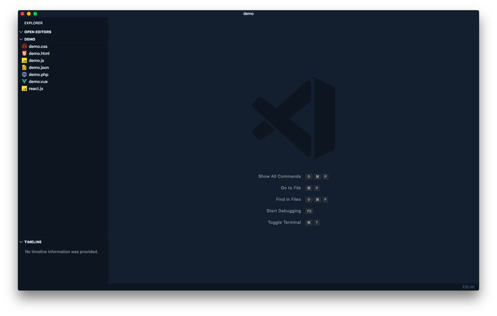
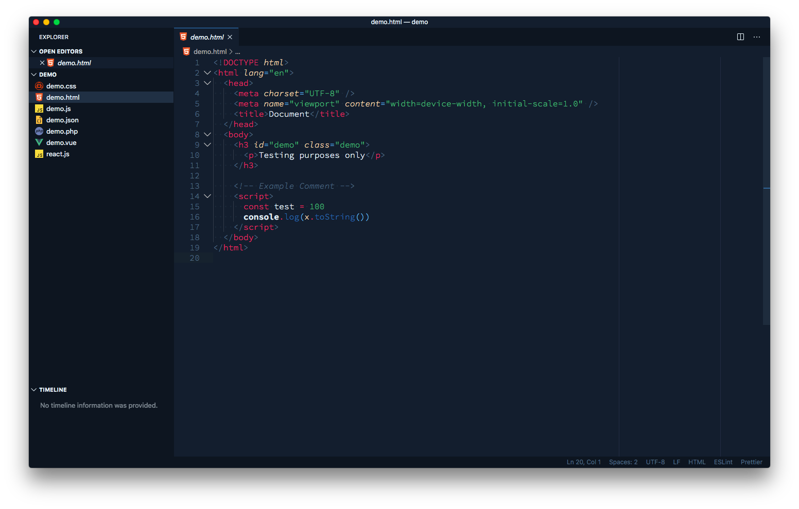
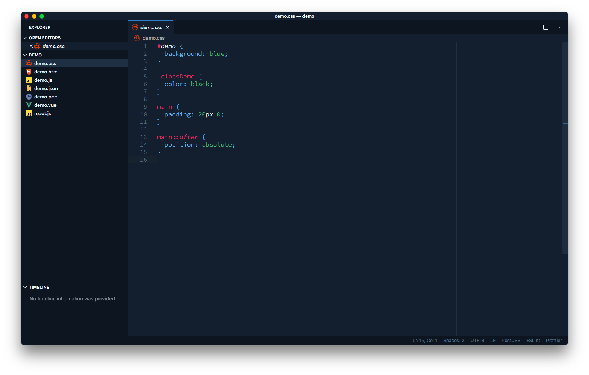
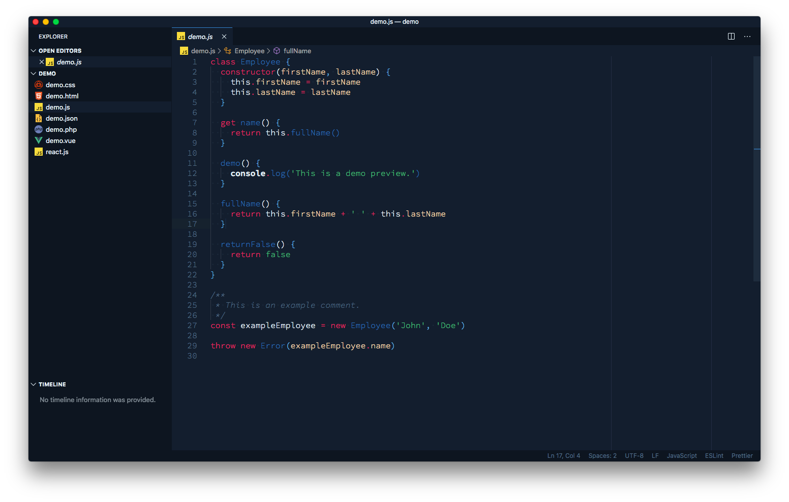
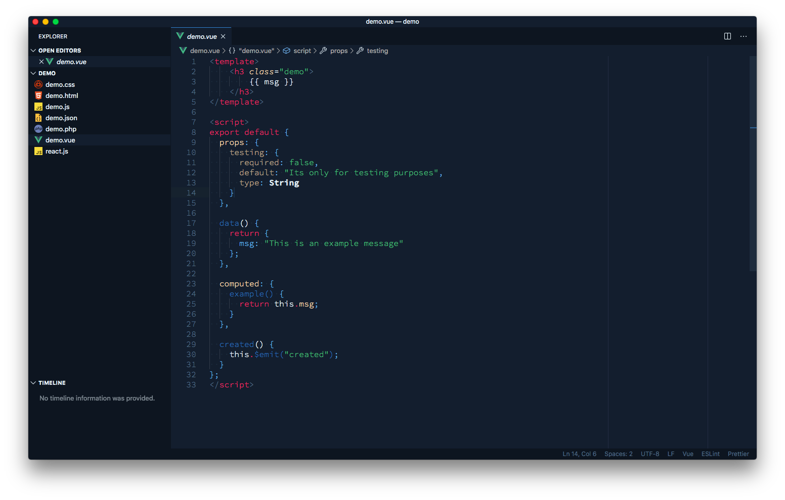
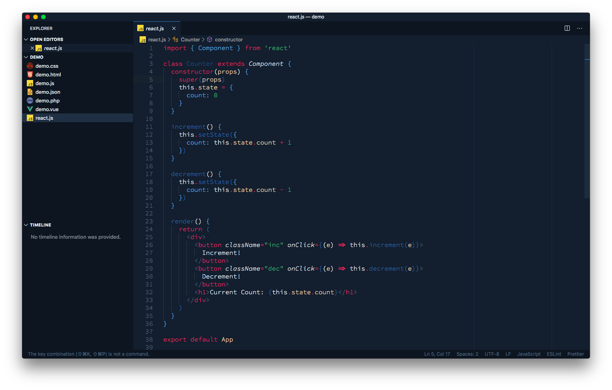
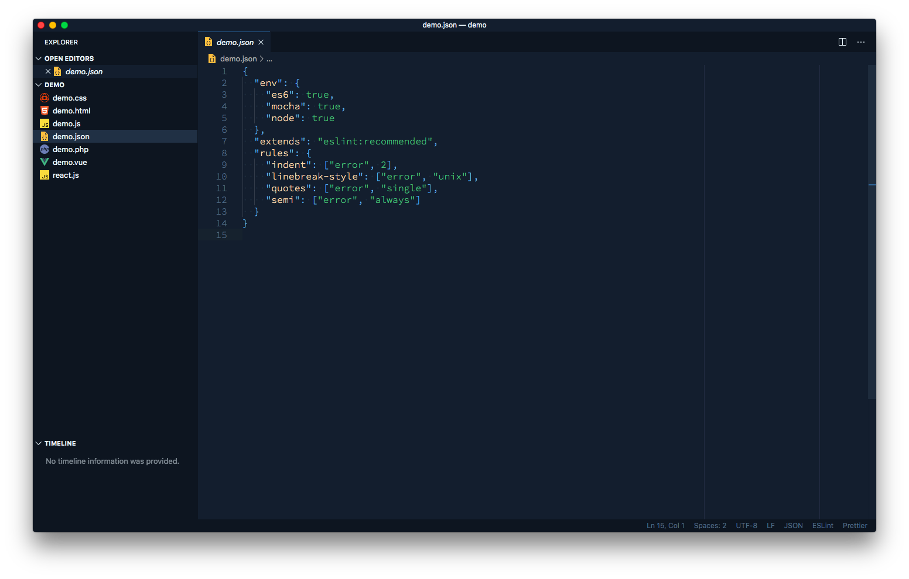

# 🌟 Fons Theme for VSCode

_Mix of colors that make up a beautiful, simple and eye-pleasing theme for VSCode._

---

## 🚀 Installation

1. Open the **Extensions** sidebar in VS Code
2. Search for `Fons Theme`
3. Click **Install**
4. Open the **Command Palette** with `Ctrl+Shift+P` or `⇧⌘P`
5. Select **Preferences: Color Theme** and select Fons Theme.
6. Enjoy! 🎉

---

## 🎨 Color Palette

- Darkest Blue (ex. main background): **#0d1520**
- Blue (ex. border in open editors): **#3182ce**
- Lightest Blue (ex. foreground): **#ebf8ff**
- Some variation of blue (ex. inactive text foreground): **#4f6880**
- Dark Blue (ex. editor background): **#131e2e**
- Yellowish: **#FFD6AE**
- Magenta/Red combo: **#EC2864**
- Green: **#48BB78**
- Bolder Blue: **#2B6CB0**
- Smoother/Light Blue: **#63b3ed**

---

## 💻 Preview

**Main Layout**

**HTML**

**CSS**

**JavaScript**

**Vue**

**PHP**

**React**

**JSON**

---

## ⛑ Support

Reach out to me at one of the following places!

- Website at <a href="https://bangjelkoski.com" target="_blank">`bangjelkoski.com`</a>
- Twitter at <a href="https://twitter.com/bangjelkoski" target="_blank">`@bangjelkoski`</a>

---

## 🔓 License

Icon from [Flaticon](https://www.flaticon.com/)
